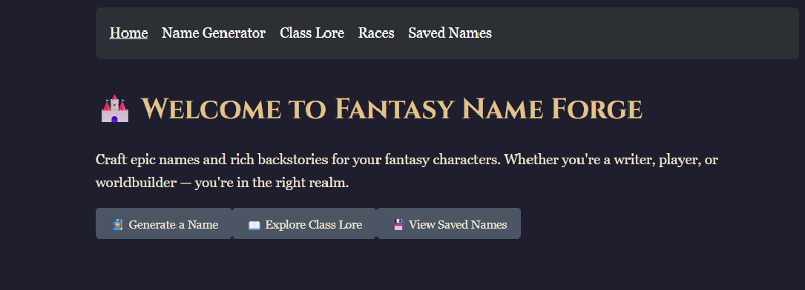
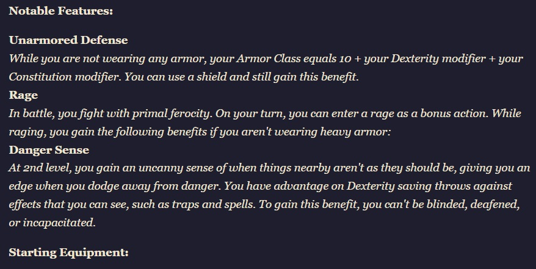
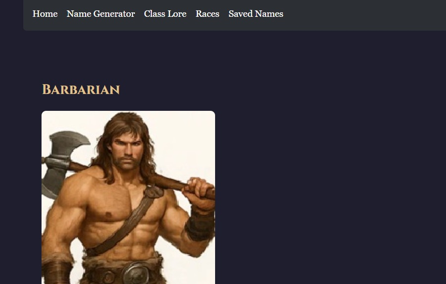

# 🧝 FantasyNameForge

Welcome to **FantasyNameForge**, a whimsical web application that generates fantasy character names and backstories using live data from the [D&D 5e API](https://www.dnd5eapi.co/). Users can save their favorite creations and browse them later. Designed with React and styled for ease of use, this app serves as a creative companion for writers, gamers, and dreamers alike.

---

## 📌 Live Site

👉 [Live Demo on Netlify](https://your-netlify-deployment-url.netlify.app)

---

## 🛠 Technologies Used

- **React** – Component-based architecture for UI rendering
- **React Router v6+** – For multi-page SPA routing
- **JavaScript (ES6+)** – Core logic and interactivity
- **HTML/CSS** – Structure and styling
- **Context API** – For managing saved characters (no Redux)
- **Fetch API** – To retrieve class data from the D&D 5e API
- **Netlify** – Hosting and deployment

---

## 🚀 Features

- 🎲 Generate random fantasy names & backstories
- 📚 Uses live class data from the D&D 5e API
- 💾 Save and manage your favorite characters
- 🗑️ Delete any saved names
- 🔁 React Router for seamless page navigation
- ❌ 404 fallback for unknown routes
- 📱 Responsive design

---

## 🧭 Application Routes

| Route | Description |
|-------|-------------|
| `/` | Home view with introductory info |
| `/generator` | Main name generation interface |
| `/lore` | Class lore explorer |
| `/races` | Race list (optional expansion) |
| `/classes/:index` | Class details (dynamic route) |
| `/ability-scores/:index` | Ability score details (dynamic route) |
| `/saved` | Saved characters list |
| `*` | 404 Not Found view |

---

## 📂 Project Structure

```
src/
├── App.jsx
├── main.jsx
├── context/
│   └── SavedNamesContext.jsx
├── pages/
│   ├── Home.jsx
│   ├── NameGenerator.jsx
│   ├── SavedNames.jsx
│   ├── ClassLore.jsx
│   ├── RaceList.jsx
│   ├── ClassDetail.jsx
│   └── AbilityScoreDetail.jsx
├── assets/
├── index.css
└── ...
```

---

## 📥 Installation & Usage

```bash
# Clone the repo
git clone https://github.com/yourusername/fantasynameforge.git

# Navigate into the project
cd fantasynameforge

# Install dependencies
npm install

# Start development server
npm run dev
```

---

## 🧠 Future Improvements

- Persist saved names using `localStorage`
- Add sound effects or background music toggle
- Class/race filters for targeted generation
- Tooltip components and animations
- Theme switcher (dark/light mode)
- had syntax error with button need to go back and fix

---

## 🐛 Known Issues

- Some class details may require additional API fetches to fully flesh out lore
---

## 👨‍🏫 Project Motivation

This application was built as part of the **SBA 320H React Web Application Project** for Per Scholas. The goal was to demonstrate mastery of React fundamentals, API integration, and user-centric design—without relying on Redux.

---

## 🙏 Acknowledgements

- [D&D 5e API](https://www.dnd5eapi.co/) – Open-source resource for fantasy data
- [React Router Docs](https://reactrouter.com/) – For navigation setup
- Classmates and instructors at **Per Scholas**

---

## 📸 Screenshots


---


